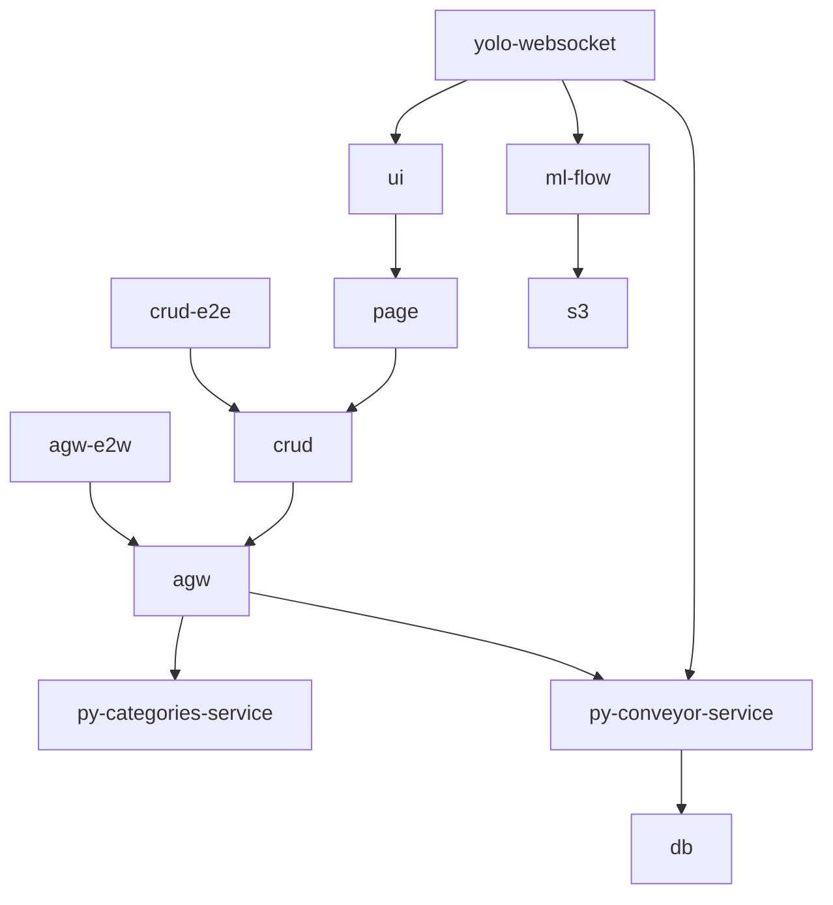

# Искуственный - да, Интелект- нет

✨ Нами был реализован микросервисный комплекс использующий ансамбль свёрточных нейронных сетей на базе YOLO v8 и Torch Vision. Мы провели анализ доступных архитектур для решения поставленной задачи и остановились на данном решении ввиду его производительности. Наша платформа поставляется вместе с оптимизированными сервисами сбора метрик и современным WEB-интерфейсом. Кроме этого мы интегрировали наш программный продукт с промышленными системами видеонаблюдения mars.

## Развертывание

### Backend
```bash
cd apps
```
```bash
sudo docker-compose up -d
```
### Frontend
```bash
npm i -g nx
```
```bash
nx run crud:serve:development --host=0.0.0.0
```

### Model
```bash
cd yolo-websocket
```
```bash
git checkout master
```
```bash
sudo docker-compose up -d
```

#### Альтернативный запуска (не рекомендуем)
```bash
nx run-many -t py-categories-service py-conveyor-service crud
```

После запуска приложение будет доступно на http://localhost:4200

|  Name   |                                              Source                                              | Deploy URL | Hosted URL                     |
|:-------:|:------------------------------------------------------------------------------------------------:| :---: |:-------------------------------|
|   WEB   |                [crud](https://github.com/perm-hack/perm-hack/tree/main/apps/crud)                | http://localhost:4200 | https://ayin.k-lab.su          |
| Backend | [py-conveyor-service](https://github.com/perm-hack/perm-hack/tree/main/apps/py-conveyor-service) | http://localhost:4200/api/docs | https://ayin.k-lab.su/api/docs |
|  Model  |                                        [yolo-websocket](https://github.com/95862888/yolo-websocket/tree/master)                                        |                                |                                |

## Архитектура



ML-Flow & s3 развернуты в локальной сети.


